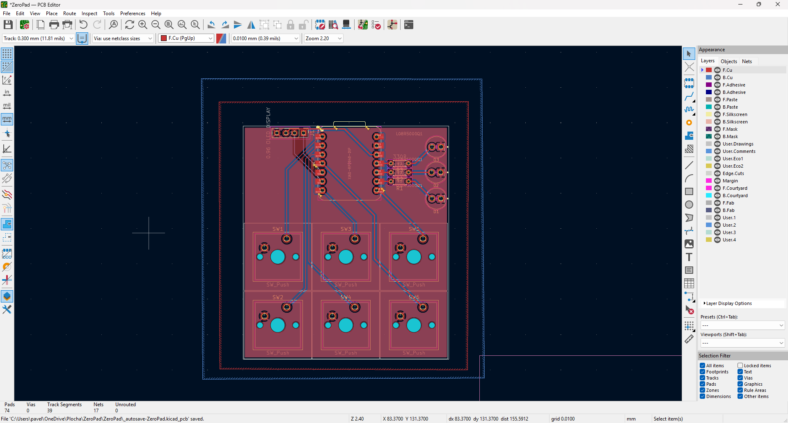
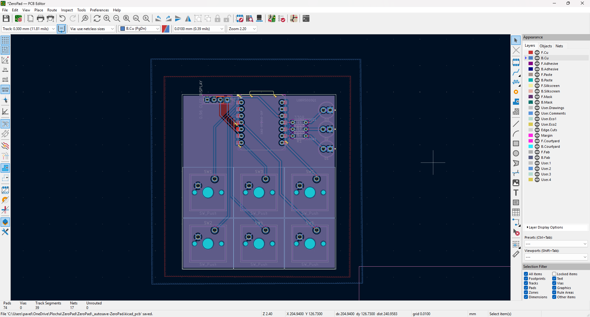
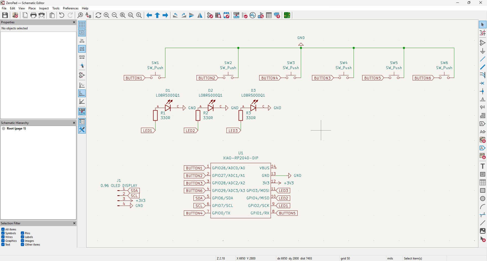

# ZeroPad - Custom Macropad

The pathfinder project is great hardware introduction project, but I wanted to do bit more, that I would use daily - specifically for quick shortcuts as a keyboard to my computer.

I designed a custom PCB in KiCad featuring a 2x3 matrix with 6 mechanical Cherry MX switches, and I also added a 4-pin header for a 0.91 I2C OLED display. The display is intended to show the currently active macro profile (such as gaming Mode or work Mode). The board layout was carefully optimized for standard 1U keycap spacing to avoid keycaps collisions.

## Project Features

* **Microcontroller:** Seeed Studio XIAO RP2040
* **Switches:** 6x Mechanical Cherry MX Switches
* **Display:** 0.91 I2C OLED Display for active mode rendering
* **Status LEDs:** 3x basic LEDs for hardware debugging/status
* **PCB Design:** Custom 2-layer board routed in KiCad with dual Cu GND pours for a clean finish.

## Gallery

### 3D PCB Renders

### PCB Routing & Schematic

---

## Bill of Materials (BOM)

| Component | Qty | Purpose / Description | Price (USD) | Link / Distributor |
| :--- | :---: | :--- | :--- | :--- |
| **Custom PCB Manufacture** | 5 | The actual circuit board to solder everything on. Ordered via JLCPCB standard 2-layer service. | ~$4.74 | [JLCPCB](https://jlcpcb.com) |
| **Seeed Studio XIAO RP2040** | 1 | Main microcontroller / brain for the macropad. Small footprint, plenty of GPIOs. | ~$7.88 | [AliExpress](https://a.aliexpress.com/_EyHIJs2) |
| **0.91" I2C OLED Display** | 1 | Screen to show active macro profiles and current modes. | ~$2.00 | [AliExpress](https://a.aliexpress.com/_EGSrJ7g) |
| **Cherry MX Switches (10-pack)** | 1 | Mechanical switches for the macro buttons. | ~$6.08 | [AliExpress](https://a.aliexpress.com/_EuLENRY) |
| **1U Blank Keycaps (10-pack)** | 1 | Standard covers for the mechanical switches. | ~$3.35 | [AliExpress](https://a.aliexpress.com/_Eyx6JJo) |

---

## Firmware Note
The firmware is written in C++ using the Arduino IDE. It utilizes the `Keyboard.h` library to send macros and shortcuts, and the `Adafruit_SSD1306` library to drive the OLED display. The buttons are connected to digital pins using the `INPUT_PULLUP` method.

*(A quick note to the reviewers: I added the OLED display to make the project uniquely mine. If adding the display pushes this out of the Starter Project grant limits, please feel free to strike the display from the BOM. I am completely fine with buying the screen with my own cash, I just wanted to build a tool I will actually use.)*
