# ZeroPad - Custom Macropad

The pathfinder project is great hardware introduction project, but I wanted to do bit more, that I would use daily - specifically for quick shortcuts as a keyboard to my computer.

I designed a custom PCB in KiCad featuring a 2x3 matrix with 6 mechanical Cherry MX switches, and I also added a 4-pin header for a 0.91 I2C OLED display. The display is intended to show the currently active macro profile (such as gaming Mode or work Mode). The board layout was carefully optimized for standard 1U keycap spacing to avoid keycaps collisions.

## Project Features

* **Microcontroller:** Seeed Studio XIAO RP2040
* **Switches:** 6x Mechanical Cherry MX Switches
* **Display:** 0.91 I2C OLED Display for active mode rendering
* **Status LEDs:** 3x basic LEDs for hardware debugging/status
* **PCB Design:** Custom 2-layer board routed in KiCad with dual Cu GND pours for a clean finish.

## Gallery

### Build Preview
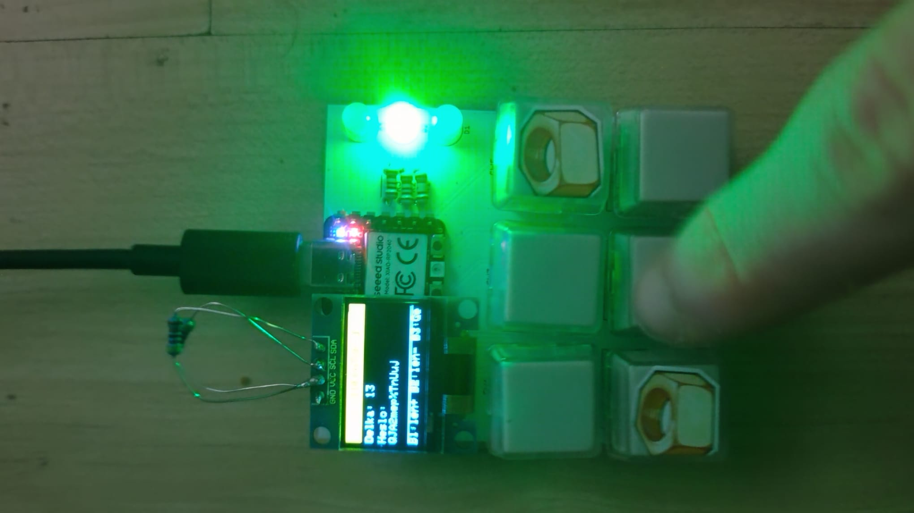
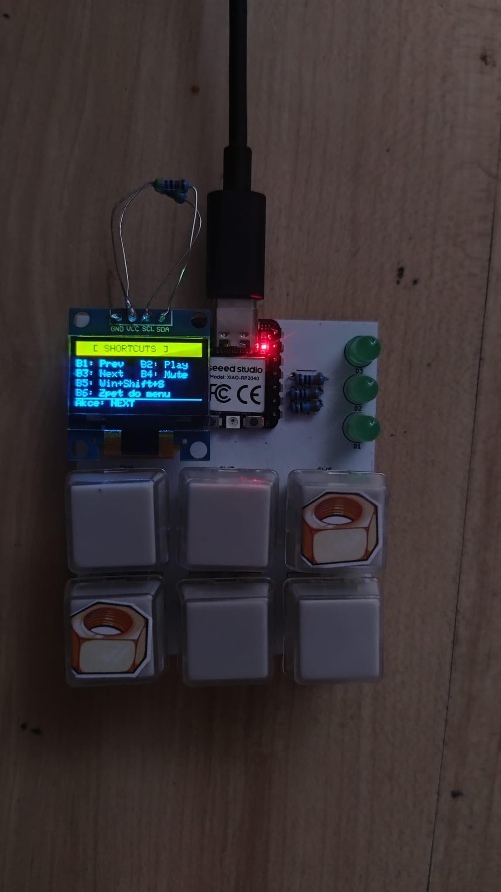
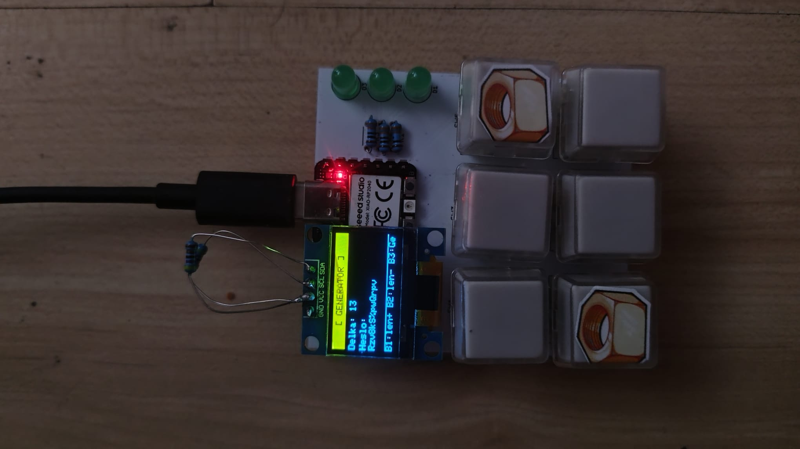

### 3D Assembly Renders
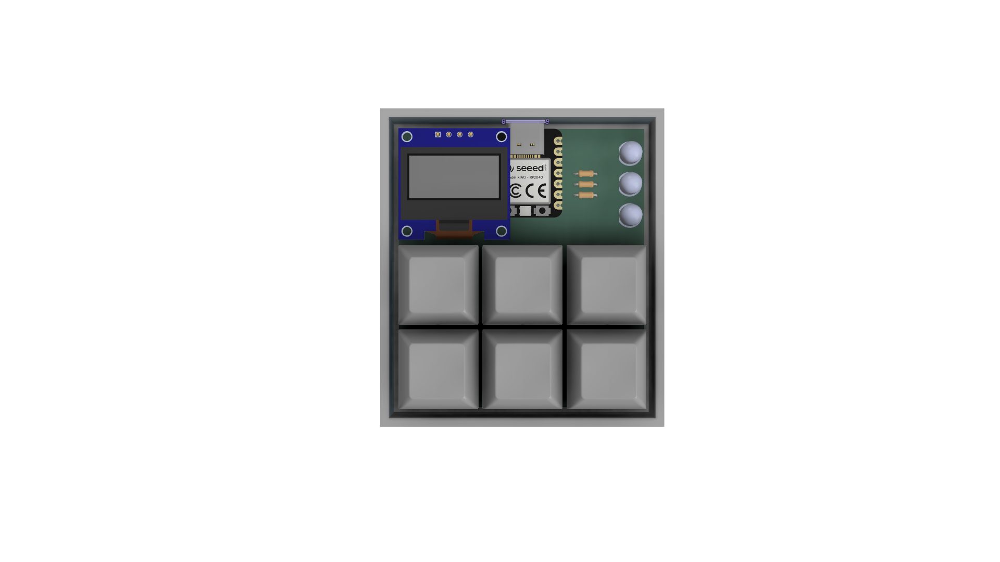
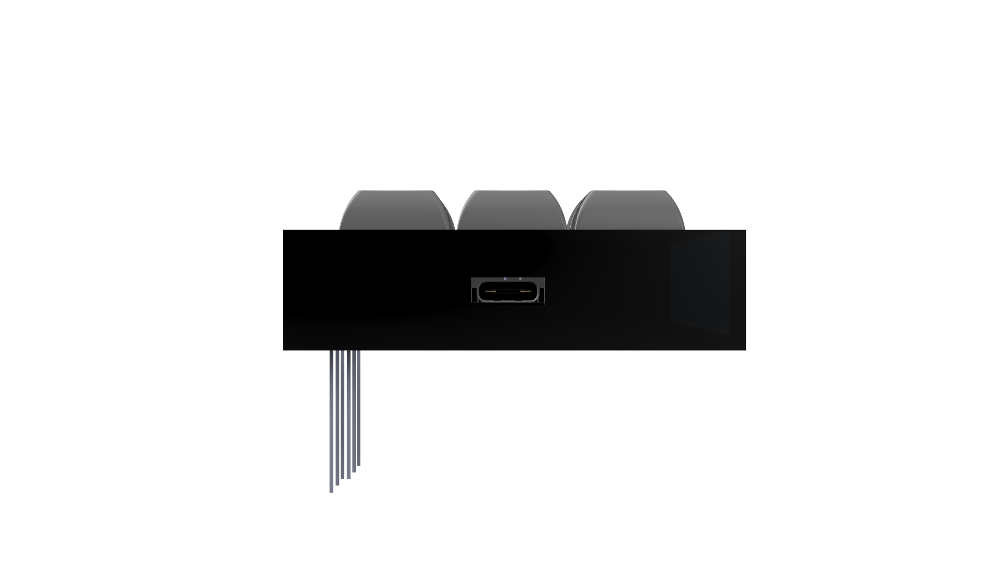
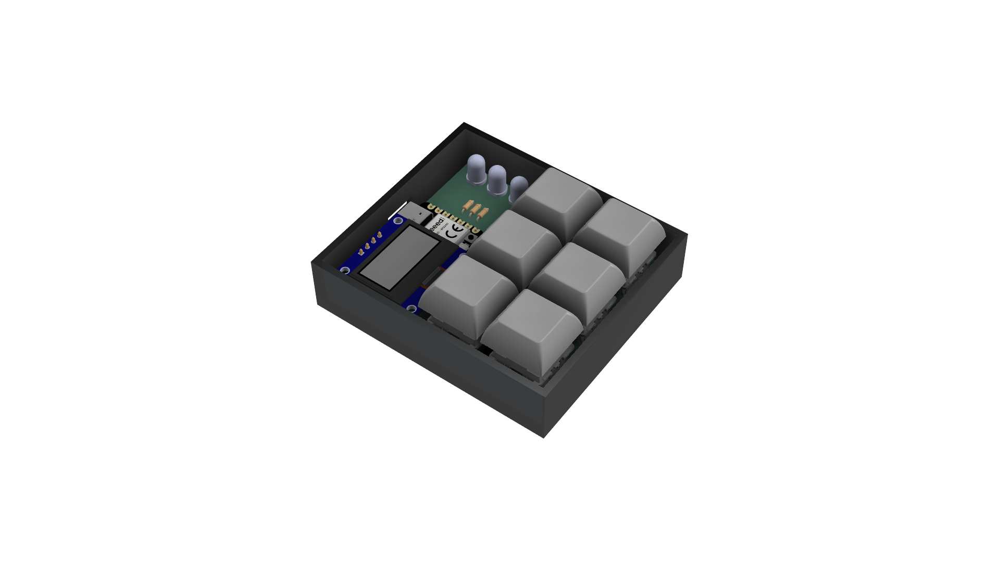

### 3D PCB Renders

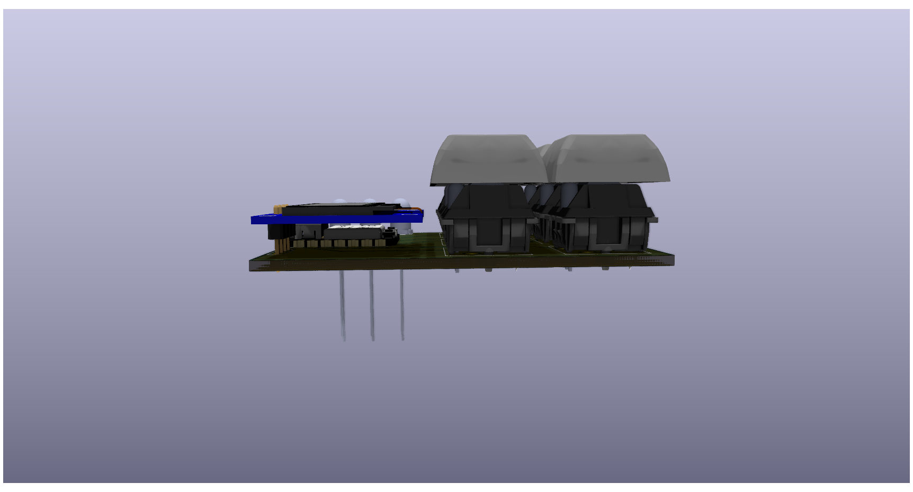
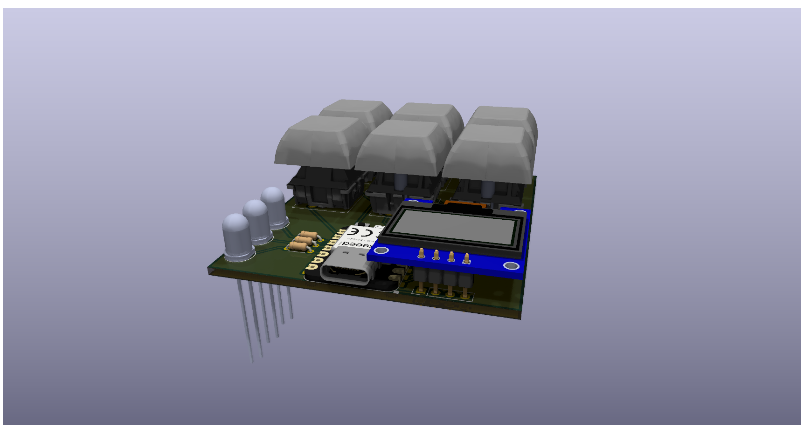

### PCB Routing & Schematic
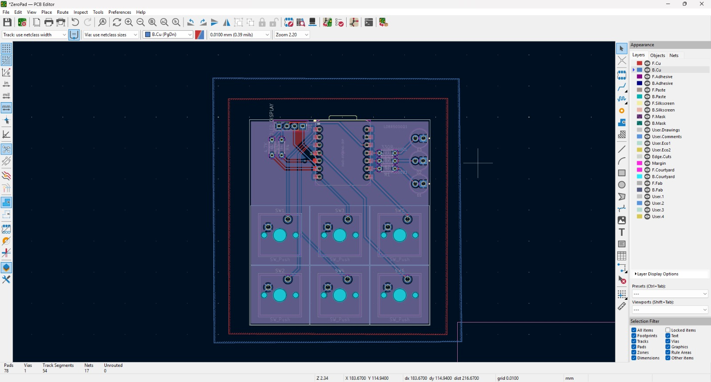
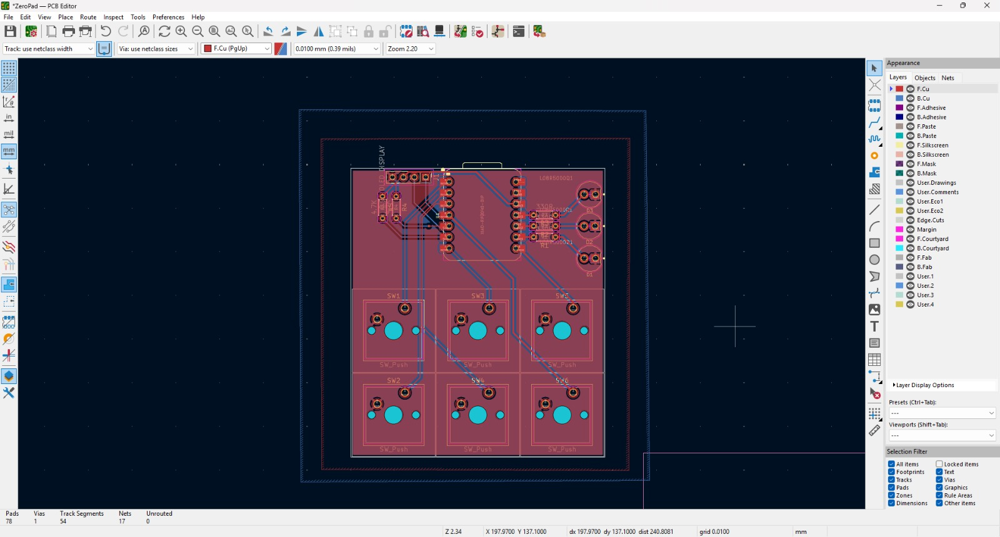
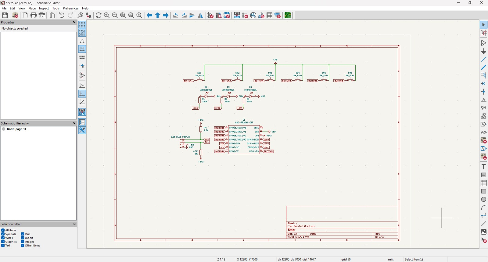

---

## Bill of Materials (BOM)

| Component | Qty | Purpose / Description | Price (USD) | Link / Distributor |
| :--- | :---: | :--- | :--- | :--- |
| **Custom PCB Manufacture** | 5 | The actual circuit board to solder everything on. Ordered via JLCPCB standard 2-layer service. | ~$4.74 | [JLCPCB](https://jlcpcb.com) |
| **Seeed Studio XIAO RP2040** | 1 | Main microcontroller / brain for the macropad. Small footprint, plenty of GPIOs. | ~$7.88 | [AliExpress](https://a.aliexpress.com/_EyHIJs2) |
| **0.96" I2C OLED Display** | 1 | Screen to show active macro profiles and current modes. | ~$2.00 | [AliExpress](https://a.aliexpress.com/_EGSrJ7g) |
| **Cherry MX Switches (10-pack)** | 1 | Mechanical switches for the macro buttons. | ~$6.08 | [AliExpress](https://a.aliexpress.com/_EuLENRY) |
| **1U Blank Keycaps (10-pack)** | 1 | Standard covers for the mechanical switches. | ~$3.35 | [AliExpress](https://a.aliexpress.com/_Eyx6JJo) |
| **5mm Green LEDs** | 3 | Status LEDs for debugging (Bought locally, link is equivalent). | ~$0.50 | [SparkFun](https://www.sparkfun.com/products/9592) |
| **330 Ohm Resistors** | 3 | Current limiting resistors for the LEDs (Bought locally). | ~$0.50 | [SparkFun](https://www.sparkfun.com/resistor-330-ohm-1-6th-watt-pth.html) |
| **4.7k Ohm Resistors** | 2 | I2C pull-up resistors for stable OLED communication. | ~$0.50 | [Dratek.cz](https://dratek.cz/arduino-platforma/174921-metalizovany-rezistor-4k7-5w-1.html) |

---
